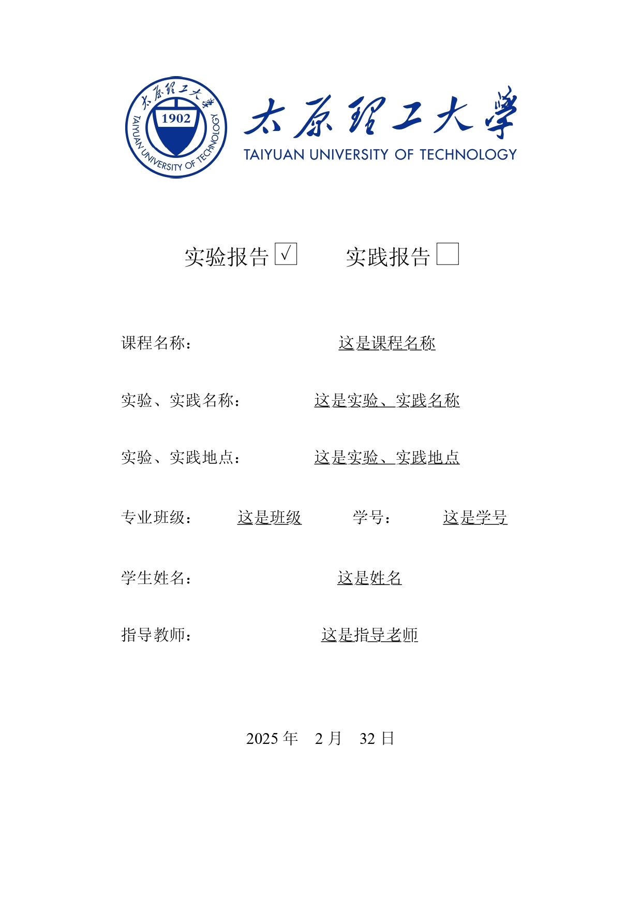
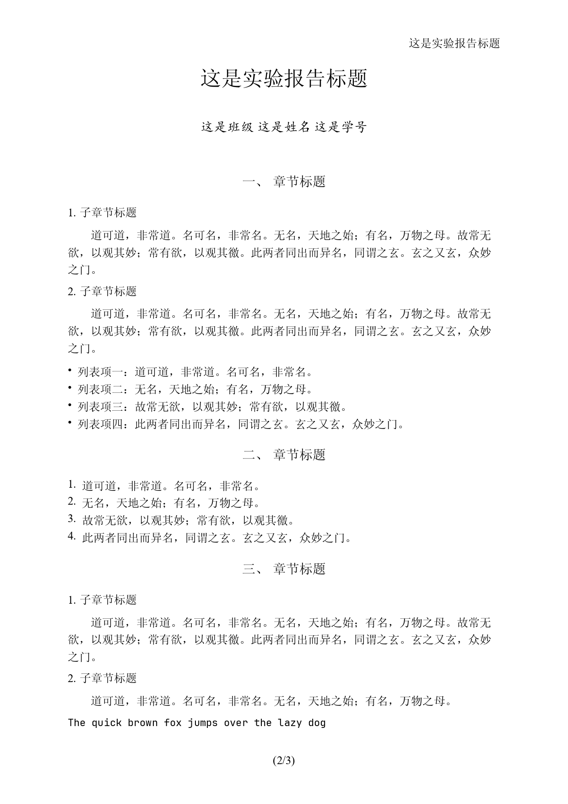
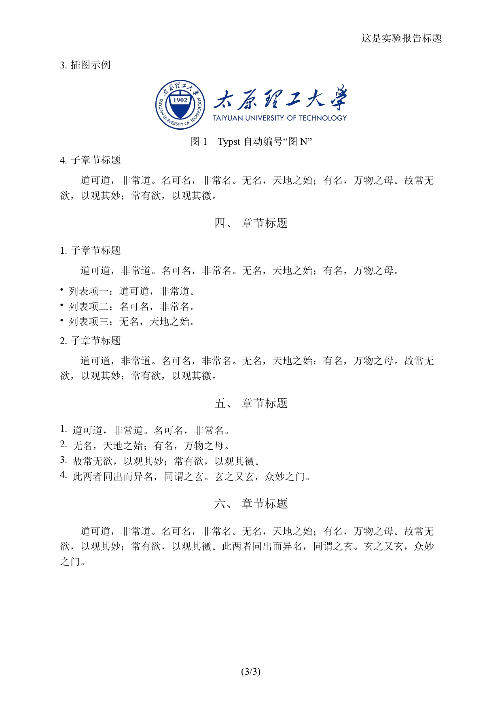

# TYUT Typst 实验报告模板

TYUT实验报告的 Typst 模板

## 简介

- Typst 是一种新型的标记语言排版系统，拥有类似 Markdown 的简洁语法，同时具备强大的排版能力。相比于 Word 或 LaTeX，Typst 的编译速度极快，且语法更加友好。

- **适合 AI 上手编写**

- 目前提供两种模板：
  - **含封面版 (`experiment_template_WithCover.typ`)**: 包含完整的校徽封面页。
  - **无封面版 (`experiment_template_NoCover.typ`)**: 仅包含正文和顶部基本信息。

## 特性

<table>
  <tr>
    <td align="center">
      
      <br>
    </td>
    <td align="center">
      
      <br>
    </td>
    <td align="center">
      
      <br>
    </td>
  </tr>
</table>

- **自动编号**：支持一、二、(1) 等级别的自动标题编号。
- **样式统一**：预设了符合实验报告规范的字号、字体（宋体/Times New Roman）和缩进。
- **代码美化**：Typst 支持代码高亮，让代码块展示更专业。
- **易于使用**：只需修改顶部的变量定义，即可生成精美的 PDF 报告。

## 使用说明

### 1. 环境准备

建议搭配 VS Code 插件 Tinymist Typst 食用。

直接使用 `typst` 编译可能遇到字体找不到的问题，需要自行解决

### 2. 编写报告

在 `.typ` 文件的顶部，修改以下变量信息：

```typst
// ==================== 变量定义 ====================
#let report-title = "这是实验报告标题"
#let course-name = "数字电路实验"
#let experiment-name = "组合逻辑电路的设计"
#let student-id = "202300XXXX"
#let student-name = "张三"
// ... 
```

修改完成后，可以在 VS Code 内实时预览或导出为 PDF

## 依赖

- **默认字体**：
  - 中文：优先使用系统自带的宋体（Windows `SimSun` / macOS `Songti SC` / `STSong` 等），然后尝试使用[思源宋体 (Source Han Serif SC)](https://github.com/adobe-fonts/source-han-serif/tree/release/)
  - 英文：Times New Roman
  - 代码：[JetBrains Mono](https://www.jetbrains.com/lp/mono/)
- **校徽图片**：`tyut.png` (由封面版模板引用)

## 协议

本项目采用 [MIT License](LICENSE) 开源。
